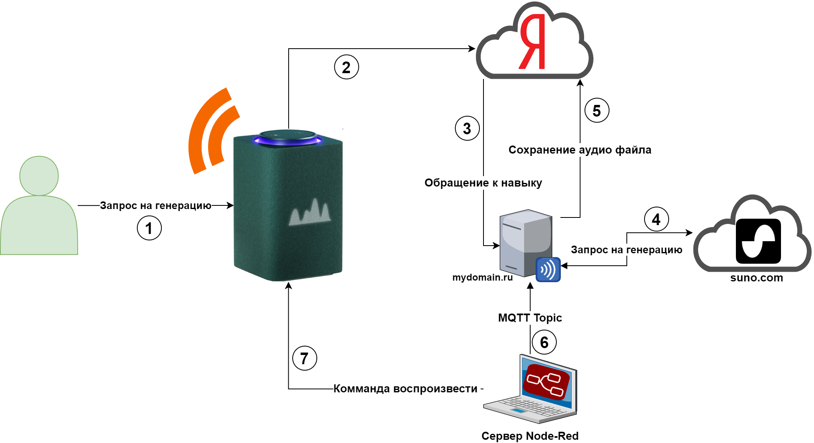

# Alice Suno
Навык Яндекс Алисы для взаимодействия с сервисом генерации музыки Suno.<br>
С помощью навыка можно попросить Алису придумать песню, которую она затем воспроизведет на умной калонке.

[](https://www.youtube.com/watch?v=InBtUOSfXyI)

# Алгоритм работы


# Подготовка
Нам понадобятся: 
* Сервер сервер, привязанный к домену с действующим SSL-сертификатом. Самоподписанный сертификат не подойдет.
* Сервер в одной локальной сети с умной колонкой<br>
Поскольку на ответ от навыка отводится ограниченное время, а композиция генерируется достаточно долго, возникает необходимость в возможности по завершении генерации запросить у Алисы воспроизведение трека, загруженного в ресурсы навыка. Это можно сделать из локальной сети, используя расширение к Node-Red под названием [node-red-contrib-yandex-station-management](https://flows.nodered.org/node/node-red-contrib-yandex-station-management). Данное расширение позволяет выполнять команды на колонке из локальной сети, произносить фразы и многое другое. Также имеется возможность воспроизведения звука, сохраненного в ресурсах навыка.
* MQTT сервер, который будет доступен как из локальной сети, так и с сервера с навыком.
Он понадобаиться нам для того чтобы сообщить серверу в локальной сети что композиция сгенерирована и успешно загружена в ресурсы навыка.
* Создать новый диалог [тут](https://dialogs.yandex.ru/). Про создание диалогов можно почитать [тут](https://habr.com/ru/articles/434194/) [тут](https://habr.com/ru/articles/465275/), [тут](https://habr.com/ru/articles/725704/), [тут](https://habr.com/ru/articles/478122/)

# Установка
```
git clone https://github.com/guinmoon/alice_suno.git 
cd alice_suno 
pip install -r reuirements.txt 
```
# Конфигурация

1) Настроить сервер взаимодействия с навыком<br>
Пример конфигурации Nginx, для создания end-point взаимодействия с навыком, используется сертификат letsencrypt
```
server {
    server_name mydomain.ru;

    location /alice-suno/ {
      proxy_pass http://localhost:8080/;
      proxy_set_header Host $http_host;
      proxy_set_header Upgrade $http_upgrade;
      proxy_set_header Connection upgrade;
      proxy_set_header Accept-Encoding gzip;
    }

    listen [::]:443 ssl ipv6only=on; # managed by Certbot
    listen 443 ssl; # managed by Certbot
    ssl_certificate /etc/letsencrypt/live/mydomain.ru/fullchain.pem; # managed by Certbot
    ssl_certificate_key /etc/letsencrypt/live/mydomain.ru/privkey.pem; # managed by Certbot
    include /etc/letsencrypt/options-ssl-nginx.conf; # managed by Certbot
    ssl_dhparam /etc/letsencrypt/ssl-dhparams.pem; # managed by Certbot

}
server {
    if ($host = mydomain.ru) {
        return 301 https://$host$request_uri;
    } # managed by Certbot
    listen 80;
    listen [::]:80;
    server_name mydomain.ru;
    return 404; # managed by Certbot
}
```

В настройках навыка в качестве endpoint указываем:
```
https://mydomain.ru/alice-suno/ 
```

2) Скопировать файл config_sample.py в config.py и указать свои параметры
3) Авторизоваться в Suno и получить Cookie 


# Запуск
```
python3 alice_suno.py
```


Если все правильно то в консоли тестирования навыка при открытии вкладки отладка вы должны увидеть "Привет я Суно"<br>
Если вы отправите любой текст навык должен ответить "Придумываю песню"<br>
После создания трека он должен появиться в директории `output`, а в MQTT топике suno должна появиться комманда для его воспроизведения<br>

# Конфигурация клиента в локальной сети
Нам понадобиться:
* Node-Red
* Плагин [node-red-contrib-yandex-station-management](https://flows.nodered.org/node/node-red-contrib-yandex-station-management).

Установка: 
1) Импортируйте файл `alice_suno.json` в node-red и настройте компонент взаимодействия с умной колонкой
2) Проверьте работоспособность отправив любую фразу, убедитесь что Алиса ее произнесла
3) Настройте MQTT узел на ваш сервер

Все готово, можно просить Алису придумать песню.

```
# Пример вывода при правильной работе 

======== Running on http://localhost:8080 ========
(Press CTRL+C to quit)
в стиле хип хоп про блок хабра хабр
5
Waiting for results...
...
['https://audiopipe.suno.ai/?item_id=7375d33b-fc76-4945-8f4f-7bf57a6b8ee2', 'https://audiopipe.suno.ai/?item_id=a3d139a4-e666-4a2c-98e5-168e574ebcb3']
Downloading song... 7375d33b-fc76-4945-8f4f-7bf57a6b8ee2
Send `<speaker audio="dialogs-upload/37cbad04-a60e-4a9b-833b-1e47352e5cf5/f9c6753d-cf34-4479-a15a-50e0de651ea4.opus">` to topic `suno`
UploadedSound(_raw_kwargs={}, id='f9c6753d-cf34-4479-a15a-50e0de651ea4', originalName='suno_7375d33b-fc76-4945-8f4f-7bf57a6b8ee2.mp3', skillId='37cbad04-a60e-4a9b-833b-1e47352e5cf5', size=None, createdAt='2024-05-20T15:23:35.422Z', isProcessed=False, error=None)
```

# Благодарость
В ходе разработки использованы следующие репозитории:

[aioalice](https://github.com/mahenzon/aioalice) от [mahenzon](https://github.com/mahenzon)<br>
[SunoSongsCreator](https://github.com/yihong0618/SunoSongsCreator) от [yihong0618](https://github.com/yihong0618)
